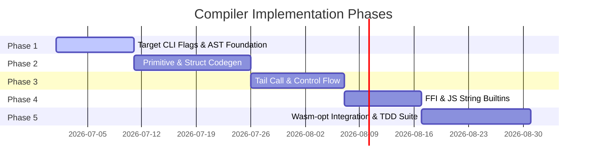

# Gleam-to-Wasm GC Compiler Spec: Roadmap & Verification

This document specifies the verification plan, Red/Green TDD strategy, and implementation phases for the compiler backend.

---

## 1. Verification & Testing Strategy (TDD)

To guarantee compiler correctness, the backend implementation will follow a strict Red/Green Test-Driven Development (TDD) cycle.

### Automated Test Harness:
The compiler test suite will use a Rust-based integration testing framework inside the Gleam compiler repository:
1. **Assertion Phase (Red):** Write a Gleam test script along with the expected output value (e.g., testing list traversal).
2. **Compilation Phase:** Run the compiler to target Wasm.
3. **Execution Phase:** Execute the resulting `.wasm` binary in a host environment (e.g., V8's `d8` shell or `wasmtime`) and capture stdout or the returned value.
4. **Validation Phase (Green):** Match the output value against expectations.

```rust
// Conceptual Rust Test in compiler integration tests
#[test]
fn test_wasm_list_map() {
    let gleam_code = "
      pub fn double_list(xs: List(Int)) -> List(Int) {
        case xs {
          [] -> []
          [x, ..rest] -> [x * 2, ..double_list(rest)]
        }
      }
    ";
    let compiled_wasm = compile_to_wasm(gleam_code);
    let output = run_wasm_module(compiled_wasm, "double_list", vec![WasmVal::List(vec![1, 2, 3])]);
    assert_eq!(output, WasmVal::List(vec![2, 4, 6]));
}
```

---

## 2. Binary Size & Performance Benchmarks

To ensure the compiler satisfies the "lightweight binaries" requirement:
* **Binary Size Targets:**
  * Hello World module: `< 2 KB`
  * Fully featured List map/filter module: `< 5 KB`
  * standard library prelude: `< 15 KB`
* **Size Optimization Pipeline:** Integrate `wasm-opt` (from Binaryen) directly into the compilation pipeline to run:
  * `--gcrefs`: Optimize GC references.
  * `--dce` / `--vacuum`: Remove unused structs, variants, and function definitions.
  * `-O3` / `-Os`: Optimize for speed and size.

---

## 3. Implementation Roadmap



### Actionable Next Steps:
1. **Bootstrap CLI:** Add `wasm-web` and `wasm-wasi` targets to `gleam build` flags.
2. **Core AST Setup:** Implement the internal `WasmExpr` representation.
3. **Draft TDD Cases:** Write the first 10 basic Gleam files (math, boolean operations, list constructors) to drive early compiler iteration.
