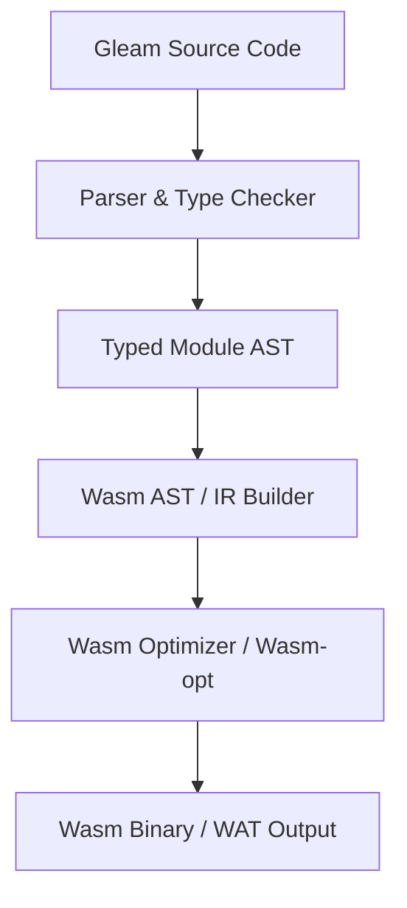

# Gleam-to-Wasm GC Compiler Spec: Vision & Architecture

This document outlines the product vision, core design goals, and high-level compiler architecture for compiling Gleam directly to WebAssembly Garbage Collection (Wasm GC).

---

## 1. Product Vision & Goals

The target is a compiler backend that outputs lightweight, high-performance WebAssembly binaries by compiling Gleam directly to Wasm GC bytecode.

### Design Goals:
* **Zero Custom GC Overhead:** Do not compile or bundle a garbage collection runtime (e.g. mark-and-sweep or reference counting) inside the Wasm binary. Rely entirely on the host VM's native GC engine.
* **Lightweight Binaries:** The compiled modules must be extremely small (targeting <10KB base runtime cost) to enable instant loads in web browsers and serverless edge functions.
* **Tail Call Optimization (TCO):** Leverage the native WebAssembly Tail Call extension to support infinite recursion, matching the execution model of the BEAM.
* **Direct Host Interoperability:** Support low-overhead interop with JavaScript/TypeScript and other hosts using reference types (`externref`) and standardized builtins.

---

## 2. High-Level Architecture

The Gleam-to-Wasm GC compiler is implemented as a backend target module within the Rust-based Gleam compiler (housed under the `compiler-core` crate).

### Compiler Components:
1. **Wasm AST (Wasm IR):** An intermediate representation in Rust that mirrors Wasm GC instructions, structural type declarations, and functional definitions.
2. **Type Mapper:** Translates Gleam's algebraic types, records, and primitives into Wasm GC struct, array, and numeric types.
3. **Function Compiler:** Walks the Gleam `TypedExpr` AST and generates Wasm GC expressions, handling local variable mapping, block structures, and tail calls.
4. **Linker/Emitter:** Emits the binary `.wasm` file or the text representation `.wat`.
